# Integrate Red Hat Developer Hub with Ansible Automation Platform

## Introduction

If you're building a developer portal with Red Hat Developer Hub (RHDH/Developer Hub) and want to integrate it with Ansible Automation Platform (AAP), one of the first challenges you'll face is authentication. How do you let developers seamlessly access both platforms without managing multiple credentials?

In this guide, I'll walk you through setting up a complete Single Sign-On (SSO) solution that connects Developer Hub, AAP, and Red Hat SSO (Keycloak). By the end, your developers will be able to:

- 🔐 Use single Keycloak credentials across the entire platform
- 🎯 Authenticate to AAP through Developer Hub's Ansible plugin
- 🚀 Launch Ansible workflows directly from Developer Hub
- 📊 View Ansible resources in the Developer Hub catalog
- 🔑 Leverage OAuth tokens for secure API communication between Developer Hub and AAP

## Architecture Overview

Here's how the pieces fit together:

```mermaid
graph LR
    Dev[👤 Developer] -->|1. Access Portal| RHDH[Red Hat Developer Hub]
    RHDH -->|2-3. OAuth Request| AAP[Ansible Automation Platform]
    AAP -->|4. OIDC Redirect| RHSSO[Red Hat SSO/Keycloak]
    RHSSO -->|5-6. Validate & Return| AAP
    AAP -->|7. OAuth Token| RHDH
    RHDH -.->|8. API Calls with Token| AAP
    AAP -->|9. Execute| Jobs[🚀 Ansible Jobs & Workflows]

    style Dev fill:#e8f5e9,stroke:#2e7d32,stroke-width:2px
    style RHDH fill:#e3f2fd,stroke:#1565c0,stroke-width:2px
    style AAP fill:#fff3e0,stroke:#ef6c00,stroke-width:2px
    style RHSSO fill:#fce4ec,stroke:#c2185b,stroke-width:2px
    style Jobs fill:#f3e5f5,stroke:#7b1fa2,stroke-width:2px
```



The authentication flow works like this:

1. Developer accesses Red Hat Developer Hub (Developer Hub)
2. The Ansible plugin shows "Sign in with Ansible Automation Platform" button
3. User clicks the button, triggering OAuth flow to AAP
4. AAP receives the OAuth request and redirects to its configured authentication provider (Keycloak/RHSSO)
5. User logs in with Keycloak credentials (can be backed by LDAP, AD, or local users)
6. Keycloak validates credentials and returns user to AAP
7. AAP issues an OAuth token and redirects back to Developer Hub
8. Developer Hub stores the token and uses it for all subsequent AAP API calls
9. User can now interact with Ansible resources directly from Developer Hub

Let's build this step by step!

## Step 1: Deploy the Infrastructure

Let's start by deploying the necessary components. We'll use Kustomize to manage our configurations, making it easy to replicate across environments.

All the code referenced in this guide is available at [https://github.com/openlab-red/rhdh-with-ansible](https://github.com/openlab-red/rhdh-with-ansible). Clone the repository to follow along!

### Install the Operators

First, install the required operators:

```bash
# Install AAP, RHSSO, and RHDH operators
oc apply -k clusters/demo/operators/aap-operator
oc apply -k clusters/demo/operators/rhsso-operator
oc apply -k clusters/demo/operators/rhdh-operator

# Wait for operators to be ready
```

### Deploy Red Hat SSO (Keycloak)

Create the SSO instance that will handle our authentication:

```bash
# Create namespace and deploy RHSSO
oc new-project rhsso
oc apply -k clusters/demo/instances/rhsso

# Wait for Keycloak to be ready
oc wait --for=condition=Ready pod -l app=keycloak -n rhsso --timeout=300s

# Verify Keycloak is accessible
oc get route keycloak -n rhsso
```

### Deploy Ansible Automation Platform

Now deploy AAP:

```bash
# Create namespace and deploy AAP
oc new-project aap
oc apply -k clusters/demo/instances/aap

# Wait for AAP to be ready (this can take 10-15 minutes)
# Check if the AAP instance is being deployed
oc get ansibleautomationplatform -n aap

# Wait for AAP pods to be ready
oc wait --for=condition=Ready pod -l app.kubernetes.io/name=aap-controller-web -n aap --timeout=900s

# Verify AAP is accessible
oc get route aap -n aap
```

## Step 2: Configure Red Hat SSO (Keycloak)

Now that AAP is up and running, let's set up the single sign-on integration. Keycloak will serve as the identity provider for AAP, and AAP will then serve as the OAuth provider for Developer Hub.

### Setting Up the Keycloak Client for AAP

First, we need to create a Keycloak client that AAP will use for SSO authentication. This client allows AAP to delegate authentication to Keycloak:


> **💡 Pro Tip**: Instead of modifying the demo files directly, consider creating your own cluster overlay! This keeps your environment-specific configurations separate and makes upgrades easier.

```bash
export DOMAIN=$(oc get ingresses.config.openshift.io cluster -o jsonpath='{.spec.domain}')

# Update the redirect URIs for AAP's OAuth callbacks from Keycloak
yq -i '.spec.client.redirectUris = [https://aap-aap.$DOMAIN/api/gateway/social/complete/*,https://aap-aap.$DOMAIN/*]' \
  clusters/demo/instances/rhsso-config/patches/keycloakclient-aap.yaml

# Update the web origins for CORS
yq -i '.spec.client.webOrigins = ["https://aap-aap.$DOMAIN"]' \
  clusters/demo/instances/rhsso-config/patches/keycloakclient-aap.yaml
```

### Setting Up the Keycloak Client for DevHub

First, we need to create a Keycloak client that DevHub will use for catalog entities syncronization.

   > **Note**: Even if you haven't deployed Developer Hub yet, you can determine the expected URL in advance. The URL follows the pattern: `https://backstage-developer-hub-<project>.apps.<cluster-domain>.com`.

```bash
export DOMAIN=$(oc get ingresses.config.openshift.io cluster -o jsonpath='{.spec.domain}')

# Update the redirect URIs for DevHub's OAuth callbacks from Keycloak
yq -i '.spec.client.redirectUris = [https://backstage-developer-hub-rhdh.$DOMAIN/api/auth/oidc/handler/frame]' \
  clusters/demo/instances/rhsso-config/patches/keycloakclient.yaml

# Update the web origins for CORS
yq -i '.spec.client.webOrigins = ["https://backstage-developer-hub-rhdh.$DOMAIN"]' \
  clusters/demo/instances/rhsso-config/patches/keycloakclient.yaml
```

Now apply the configuration to create the Keycloak client:

```bash
oc apply -k clusters/demo/instances/rhsso-config
```

This command does two important things:

- Creates an OIDC client named `aap` and `rhdh` in Keycloak that AAP will use for SSO
- Sets up test users for initial testing

### Retrieving the SSO Credentials for AAP

Now we need to get the client secret that Keycloak generated for the `aap` client. AAP will use these credentials to authenticate with Keycloak. You have two options:

**Option 1: Command Line**

```bash
# Get the client secret from the Kubernetes secret
oc get secret keycloak-client-secret-aap-client -n rhsso \
  -o jsonpath='{.data.CLIENT_SECRET}' | base64 -d

# You should see output like: 
# xGtqZLqUqJOiXXXXXXXXXXXXXXXXXXXX
```

**Option 2: Keycloak Admin Console**
```bash
# Get the Keycloak URL
KEYCLOAK_URL=$(oc get route keycloak -n rhsso -o jsonpath='https://{.spec.host}')
echo "Keycloak Console: $KEYCLOAK_URL"

# Get admin password
KEYCLOAK_ADMIN_PWD=$(oc get secret credential-rhsso -n rhsso -o jsonpath='{.data.ADMIN_PASSWORD}' | base64 -d)
echo "Admin Password: $KEYCLOAK_ADMIN_PWD"
```

If you choose the console route:

1. Login with admin credentials (retrieve them from the `credential-rhsso` secret)
2. Navigate to the `rhdh` realm
3. Go to **Clients** → **aap**
4. Click on the **Credentials** tab
5. Copy the **Secret** value


## Step 3: Configure SSO Authentication in AAP

This is where we connect AAP to use Keycloak for authentication. You can do this through the UI or API - I'll show you both approaches.

### Method 1: Using the AAP Web UI

1. **Access AAP Console**
   ```bash
   # Get your AAP URL
   AAP_URL=$(oc get route aap -n aap -o jsonpath='https://{.spec.host}')
   echo "AAP Console: $AAP_URL"
   
   # Get admin password
   AAP_ADMIN_PWD=$(oc get secret aap-admin-password -n aap -o jsonpath='{.data.password}' | base64 -d)
   echo "Admin Password: $AAP_ADMIN_PWD"
   ```

2. **Navigate to Access Management**
   - Login as `admin` (password from `aap-admin-password` secret)
   - Go to: **Access Management** → **Authentication Method** → **Create Authentication**
   - Set the desired name
   - Set the type to Keycloak

   

3. **Get the Keycloak Public Key**
   
   Before configuring AAP, you need the public key from Keycloak:
   
   ```bash
   # Get the public key from Keycloak realm
   curl -sk ${KEYCLOAK_URL}/auth/realms/rhdh | jq -r '.public_key'
   ```
   
   Or from the Keycloak Console:

   - Navigate to **Realm Settings** → **Keys** tab
   - Find the **RS256** row
   - Click **Public key** button and copy the key
   
   

4. **Configure Keycloak Parameters in AAP**
   
   Fill in these fields exactly as shown:

   

   | Field | Value |
   |-------|-------|
   | **Keycloak Provider URL** | `https://keycloak-rhsso.apps.YOUR-CLUSTER-DOMAIN.com/auth/realms/rhdh/protocol/openid-connect/auth` |
   | **Keycloak Client ID** | `aap` |
   | **Keycloak Client Secret** | The client secret from Step 2 |
   | **Keycloak Public Key** | The RS256 public key from Keycloak |
   | **Access Token URL** | `https://keycloak-rhsso.apps.YOUR-CLUSTER-DOMAIN.com/auth/realms/rhdh/protocol/openid-connect/token` |
   | **Access Token Method** | `POST` |

5. **Save the Configuration**
   - Click **Save** at the bottom of the form
   - The page should refresh with a success message

### Method 2: Using the AAP API

For automation lovers, here's how to configure SSO programmatically:

```bash
# Set your variables
KEYCLOAK_URL=$(oc get route keycloak -n rhsso -o jsonpath='https://{.spec.host}')
AAP_URL=$(oc get route aap -n aap -o jsonpath='https://{.spec.host}')

# AAP Password
AAP_PASSWORD=$(oc get secret aap-admin-password -n aap -o jsonpath='{.data.password}' | base64 -d)

# Client Secret
CLIENT_SECRET=$(oc get secret keycloak-client-secret-aap-client -n rhsso -o jsonpath='{.data.CLIENT_SECRET}' | base64 -d)

# Get the Keycloak public key
PUBLIC_KEY=$(curl -sk ${KEYCLOAK_URL}/auth/realms/rhdh | jq -r '.public_key')

# Configure Keycloak settings via API
curl -sk -X POST \
  "${AAP_URL}/api/gateway/v1/authenticators/" \
  -u "admin:${AAP_PASSWORD}" \
  -H "Content-Type: application/json" \
  -d '{
        "name": "RH SSO",
        "enabled": true,
        "type": "ansible_base.authentication.authenticator_plugins.keycloak",
        "configuration": {
            "ACCESS_TOKEN_URL": "'"${KEYCLOAK_URL}"'/auth/realms/rhdh/protocol/openid-connect/token",
            "AUTHORIZATION_URL": "'"${KEYCLOAK_URL}"'/auth/realms/rhdh/protocol/openid-connect/auth",
            "GROUPS_CLAIM": "Group",
            "KEY": "aap",
            "PUBLIC_KEY": "'"${PUBLIC_KEY}"'",
            "SECRET": "'"${CLIENT_SECRET}"'"
        }
  }'

# Expected output
# {"id":2,"url":"/api/gateway/v1/authenticators/2/"
# ...
# }  

# Verify the configuration id
curl -sk -u "admin:${AAP_PASSWORD}" \
  "${AAP_URL}/api/gateway/v1/authenticators/2/" | \
  jq '.'
```

### Verifying the SSO Configuration

After configuration, test that SSO is working:

1. **Logout from AAP**
2. **Access the login page** - You should now see an option to "Login with RH SSO"
3. **Click on it** - You'll be redirected to Keycloak
4. **Login with Keycloak credentials** - Use the test `rhdp-admin` user or any user in the `rhdh` realm
5. **Success!** - You should be redirected back to AAP, logged in via SSO


## Step 4: Create OAuth Application in AAP for Developer Hub

The final piece of the puzzle is creating an OAuth application in AAP that Developer Hub will use to allows Developer Hub to make API calls to AAP on behalf of users.

### Method 1: Through the AAP UI

1. **Navigate to Access Management**
   - Login to AAP as `admin`
   - Go to: **OAuth Applications** → **Create OAuth Application**

2. **Configure the OAuth Application**

   Fill in these fields:
   
   | Field | Value |
   |-------|-------|
   | **Name** | `RHDH Integration` |
   | **Description** | `OAuth application for Red Hat Developer Hub integration` |
   | **Organization** | `Default` (or your organization) |
   | **Redirect URIs** | `https://backstage-developer-hub-rhdh.apps.YOUR-CLUSTER-DOMAIN.com` |
   | **Authorization grant type** | `Authorization code` |
   | **Client type** | `Confidential` |
   | **Redirect URIs** | `https://backstage-developer-hub-rhdh.apps.YOUR-CLUSTER-DOMAIN.com/api/auth/rhaap/handler/frame` |

   

3. **Save and Capture Credentials**

   - Click **Save**
   - **IMPORTANT**: Copy the **Client ID** and **Client Secret** immediately
   - The Client Secret is only shown once!

4. **Skip Authorization**

   The AAP UI does not expose the `skip_authorization` option, so you must enable it via the API. This setting bypasses the OAuth consent screen that would normally prompt users to approve the application's access to their AAP account. While consent screens are useful for third-party applications, they add unnecessary friction for first-party integrations like RHDH without providing additional security.

   ```bash
    APP_ID=$(curl -sk "${AAP_URL}/api/gateway/v1/applications/" \
        -u "admin:${AAP_PASSWORD}" \
        -H "Content-Type: application/json" | \
        jq -r '.results[] | select(.name=="RHDH Integration") | .id')
        
    curl -sk -X PATCH \
    "${AAP_URL}/api/gateway/v1/applications/${APP_ID}/" \
    -u "admin:${AAP_PASSWORD}" \
    -H "Content-Type: application/json" \
    -d '{"skip_authorization": true}'
    ```

## Method 2: Direct API Calls

```bash
# Set variables
AAP_URL=$(oc get route aap -n aap -o jsonpath='https://{.spec.host}')

AAP_PASSWORD=$(oc get secret aap-admin-password -n aap \
  -o jsonpath='{.data.password}' | base64 -d)

CLUSTER_DOMAIN=$(oc get ingresses.config.openshift.io cluster -o jsonpath='{.spec.domain}')

BACKSTAGE_URL="https://backstage-developer-hub-rhdh.${CLUSTER_DOMAIN}"

# RHAAP specific redirect URL
REDIRECT_URI="${BACKSTAGE_URL}/api/auth/rhaap/handler/frame"

# Create the OAuth application
RESPONSE=$(curl -sk -X POST \
  "${AAP_URL}/api/gateway/v1/applications/" \
  -u "admin:${AAP_PASSWORD}" \
  -H "Content-Type: application/json" \
  -d '{
    "name": "RHDH Integration",
    "description": "OAuth application for Red Hat Developer Hub integration",
    "client_type": "confidential",
    "authorization_grant_type": "authorization-code",
    "app_url": "'"${BACKSTAGE_URL}"'",
    "redirect_uris": "'"${REDIRECT_URI}"'",
    "skip_authorization": true,
    "organization": 1
  }')

# Extract credentials
AAP_OAUTH_CLIENT_ID=$(echo $RESPONSE | jq -r '.client_id')
APP_OAUTH_CLIENT_SECRET=$(echo $RESPONSE | jq -r '.client_secret')

echo "AAP_OAUTH_CLIENT_ID=$AAP_OAUTH_CLIENT_ID" >> .env
echo "APP_OAUTH_CLIENT_SECRET=$APP_OAUTH_CLIENT_SECRET" >> .env
```

### Generating Personal Access Tokens

#### Method 1: Via UI

1. **Log into AAP** as an administrator
2. Click on your **username** in the top-right corner
3. Select **User Details** from the dropdown menu
4. Navigate to the **API Tokens** tab
5. Click **Create API token** button
6. Fill in the token details:
   - **Description**: `RHDH Integration Token` (or any meaningful name)
   - **Scope**: Select `Write` (allows read and write operations)
   - **Application**: Select the OAuth application you created earlier (e.g., "RHDH Integration")
7. Click **Create**
8. **Important**: Copy the generated token immediately - it will only be displayed once
9. Save the token securely in your `.env` file:
   ```bash
   AAP_TOKEN=<your-generated-token>
   REFRESH_TOKEN=<your-generated-token>
   ```


#### Method 2: Via API

You can also generate tokens programmatically using the AAP API:

```bash
# Get the application ID
APP_ID=$(curl -sk "${AAP_URL}/api/gateway/v1/applications/" \
  -u "admin:${AAP_PASSWORD}" \
  -H "Content-Type: application/json" | \
  jq -r '.results[] | select(.name=="RHDH Integration") | .id')

# Generate a new token for the application
TOKEN_RESPONSE=$(curl -sk -X POST \
  "${AAP_URL}/api/gateway/v1/tokens/" \
  -u "admin:${AAP_PASSWORD}" \
  -H "Content-Type: application/json" \
  -d '{
    "description": "RHDH Integration Token",
    "scope": "write",
    "application": "'"${APP_ID}"'"
  }')

# Extract the token
AAP_TOKEN=$(echo $TOKEN_RESPONSE | jq -r '.token')
REFRESH_TOKEN=$(echo $TOKEN_RESPONSE | jq -r '.refresh_token')

echo "AAP_TOKEN=$AAP_TOKEN" >> .env
echo "REFRESH_TOKEN=$REFRESH_TOKEN" >> .env
```

#### Generating a Personal Access Token (PAT)

A Personal Access Token (PAT) is a user-scoped token that is not tied to any specific OAuth application. This is useful for direct API access, automation scripts, or testing purposes where you need simple authentication without the OAuth flow. Unlike application tokens, PATs do not require specifying an `application` parameter.

```bash
TOKEN_RESPONSE=$(curl -sk -X POST \
  "${AAP_URL}/api/gateway/v1/tokens/" \
  -u "admin:${AAP_PASSWORD}" \
  -H "Content-Type: application/json" \
  -d '{
    "description": "RHDH PAT",
    "scope": "write"
  }')

AAP_PAT=$(echo $TOKEN_RESPONSE | jq -r '.token')
echo "AAP_PAT=$AAP_PAT" >> .env
```

## Step 5: Configure Platform Settings

There's one critical setting in AAP that must be enabled for external OAuth integration to function properly. This setting controls whether external identity providers (like Red Hat SSO/Keycloak) can authenticate users and generate OAuth2 tokens for API access.

**Why this matters:** Without this setting enabled, AAP will reject authentication attempts from external OAuth providers, even if all other configurations are correct. This is a security gate that explicitly allows federated authentication while maintaining AAP's control over token generation.

### Via UI:

1. Log into AAP Controller as an administrator
2. Navigate to **Settings** → **Platform gateway**
3. Locate the setting **"Allow external users to create OAuth2 tokens"**
4. Enable the toggle/checkbox
5. Click **Save** to apply the changes


### Via API:

```bash

curl -sk -X PUT \
  "${AAP_URL}/api/gateway/v1/settings/oauth2_provider/" \
  -u "admin:${AAP_PASSWORD}" \
  -H "Content-Type: application/json" \
  -d '{"ALLOW_OAUTH2_FOR_EXTERNAL_USERS": true}'
```

### Verify API Access

```bash
# Test that Developer Hub can call AAP API
curl -H "Authorization: Bearer ${AAP_TOKEN}" \
  "${AAP_URL}/api/controller/v2/me/" | jq
```

## Red Hat Developer Hub (RHDH) Installation

> **Note:** The secrets in `clusters/demo/.secrets/` are plain Kubernetes secrets for **demo purposes only**.  
> For production: Use **External Secrets Operator (ESO)** or **HashiCorp Vault**.

At this point, we have all the required environment variables from the previous steps:

- `AAP_URL` - AAP Gateway route
- `AAP_TOKEN` - Generated when creating AAP OAuth application
- `AAP_OAUTH_CLIENT_ID` - From AAP OAuth application
- `AAP_OAUTH_CLIENT_SECRET` - From AAP OAuth application
- `KEYCLOAK_URL` - Keycloak route
- `CLIENT_SECRET` - From creating the rhdh client in Keycloak

Optionally check the loaded environment variables before proceeding

```bash
echo "AAP_URL: $AAP_URL"
echo "AAP_TOKEN: $AAP_TOKEN"
echo "AAP_OAUTH_CLIENT_ID: $AAP_OAUTH_CLIENT_ID"
echo "AAP_OAUTH_CLIENT_SECRET: $AAP_OAUTH_CLIENT_SECRET"
echo "KEYCLOAK_URL: $KEYCLOAK_URL"
echo "CLIENT_SECRET: $CLIENT_SECRET"
```

Now we'll configure RHDH using these values.

### Step 1: Create Secrets Directory

First, create the directory structure for RHDH secrets or a specific overlay:

```bash
# Create the secrets directory for your 
mkdir -p clusters/demo/.secrets/instances/rhdh/secrets
```

### Step 2: Configure AAP OAuth Secret

Create the AAP integration secret using the OAuth credentials we configured earlier:

```yaml
# Create the AAP OAuth secret
cat <<EOF > clusters/demo/.secrets/instances/rhdh/secrets/secret-ansible-platform.yaml
apiVersion: v1
kind: Secret
metadata:
  name: ansible-platform
  namespace: rhdh
type: Opaque
stringData:
  AAP_BASE_URL: "${AAP_URL}"
  AAP_TOKEN: "${AAP_TOKEN}"
  AAP_OAUTH_CLIENT_ID: "${AAP_OAUTH_CLIENT_ID}"
  AAP_OAUTH_CLIENT_SECRET: "${AAP_OAUTH_CLIENT_SECRET}"
EOF
```

### Step 3: Create RHDH API Token Secret

Generate a secure token for RHDH internal API:

```yaml
# Generate RHDH API token
export RHDH_API_TOKEN=$(openssl rand -base64 32)

# Create the API token secret
cat <<EOF > clusters/demo/.secrets/instances/rhdh/secrets/secret-api-token.yaml
apiVersion: v1
kind: Secret
metadata:
  name: rhdh-api-token
  namespace: rhdh
type: Opaque
stringData:
  RHDH_API_TOKEN: "${RHDH_API_TOKEN}"
EOF

```

### Step 4: Create Backend Encryption Secret

```yaml
# Generate backend encryption key
export BACKEND_SECRET=$(openssl rand -base64 32)

# Create the backend secret
cat <<EOF > clusters/demo/.secrets/instances/rhdh/secrets/secret-backend.yaml
apiVersion: v1
kind: Secret
metadata:
  name: my-rhdh-secrets
  namespace: rhdh
type: Opaque
stringData:
  BACKEND_SECRET: "${BACKEND_SECRET}"
EOF

```

### Step 5: Configure GitHub App Integration (Optional)

For GitHub integration, you'll need to create a GitHub App. Skip this step if you don't need GitHub integration.

1. **Create a GitHub App**: Navigate to https://github.com/settings/apps/new
2. **Configure App Settings**:
   - **Application Name**: Choose a descriptive name (e.g., "RHDH-Integration")
   - **Homepage URL**: Your RHDH instance URL
   - **Webhook URL**: Leave blank (unless needed)
   - **Permissions**: Configure based on your requirements (typically Repository: Read, Pull requests: Read)
3. **Save and Generate Keys**: After creation, generate a private key and note down the App ID
4. **Reference Documentation**: For detailed configuration, see the [official integration guide](https://docs.redhat.com/en/documentation/red_hat_developer_hub/1.8/html-single/integrating_red_hat_developer_hub_with_github/index)

```yaml
# Create the GitHub App secret
cat <<EOF > clusters/demo/.secrets/instances/rhdh/secrets/secret-github-app-integration.yaml
apiVersion: v1
kind: Secret
metadata:
  name: rhdh-secrets-github-app
  namespace: rhdh
type: Opaque
stringData:
  # Required: GitHub App ID (from General -> About)
  GITHUB_INTEGRATION_APP_ID: "${GITHUB_INTEGRATION_APP_ID}"
  
  # Required: GitHub Client ID (from General -> About)
  GITHUB_INTEGRATION_CLIENT_ID: "${GITHUB_INTEGRATION_CLIENT_ID}"
  
  # Required: GitHub Client Secret (generate in General -> Client secrets)
  GITHUB_INTEGRATION_CLIENT_SECRET: "${GITHUB_INTEGRATION_CLIENT_SECRET}"
  
  # Required: GitHub host domain
  GITHUB_INTEGRATION_HOST_DOMAIN: "${GITHUB_INTEGRATION_HOST_DOMAIN}"
  
  # Required: Your GitHub organization name
  GITHUB_INTEGRATION_ORGANIZATION: "${GITHUB_INTEGRATION_ORGANIZATION}"
  # Required: Private key (generate in General -> Private keys)
  # Replace with your actual private key content
  GITHUB_INTEGRATION_PRIVATE_KEY_FILE: |
$(echo "$GITHUB_INTEGRATION_PRIVATE_KEY_FILE" | sed 's/^/    /')
EOF
```

## Plugin Registry Setup

To enable Ansible plugins in RHDH, you need to set up a plugin registry containing the Red Hat Ansible plugins.

### 1. Download Ansible Plugins

Download the Ansible Self-Service Automation Portal Setup Bundle from:
https://access.redhat.com/downloads/content/480/ver=2.6/rhel---10/2.6/x86_64/product-software

Extract the `ansible-plugins` directory from the downloaded bundle.

### 2. Deploy Plugin Registry

```bash
# Create a new build for the plugin registry
oc new-build httpd --name=plugin-registry --binary -n rhdh

# Build the registry image with Ansible plugins
oc start-build plugin-registry --from-dir=ansible-plugins --wait -n rhdh

# Deploy the plugin registry
oc new-app --image-stream=plugin-registry -n rhdh
```

## Understanding the Ansible Plugins

Red Hat ships the supported Red Hat Ansible Automation Platform (RHAAP) integrations for Backstage as dynamic plugins published by Red Hat.

### Frontend plugins

#### `ansible-plugin-backstage-rhaap-dynamic`
- Adds the Ansible sidebar entry and navigation experience inside RHDH
- Surfaces AAP-aware catalog information, learning paths, and template launch points
- Acts as the main UI container that other Ansible plugins extend

#### `ansible-plugin-backstage-self-service-dynamic`
- Delivers the dedicated self-service portal (`/self-service`)
- Provides simplified job-template launch flows with role-aware filtering
- Supplies opinionated UI widgets so developers can trigger automation without visiting AAP

### Backend plugins

#### `ansible-backstage-plugin-auth-backend-module-rhaap-provider-dynamic`
- Bridges Backstage authentication with AAP/Keycloak so the same identity is reused everywhere
- Manages OAuth token exchange and keeps sessions available to the other plugins

#### `ansible-backstage-plugin-catalog-backend-module-rhaap-dynamic`
- Continuously syncs organizations, teams, users, projects, and inventories from AAP into the Backstage catalog
- Enriches catalog entities with AAP annotations so resources are searchable and ownable inside RHDH

#### `ansible-plugin-scaffolder-backend-module-backstage-rhaap-dynamic`
- Supplies the scaffolder actions that operate on AAP (launch job templates, create projects, manage inventories, configure credentials)
- Lets software templates orchestrate AAP resources end-to-end without custom code

### Shared utilities

#### `ansible-plugin-backstage-rhaap-common`
- Shared types, API clients, and helpers that all of the plugins above rely on—ensure it is present any time you enable the Ansible bundles

### How they fit together

1. `ansible-backstage-plugin-auth-backend-module-rhaap-provider-dynamic` signs users into AAP and shares the token with the rest of the stack.
2. `ansible-plugin-backstage-rhaap-dynamic` and `ansible-plugin-backstage-self-service-dynamic` expose the Ansible UX surfaces inside RHDH.
3. `ansible-plugin-scaffolder-backend-module-backstage-rhaap-dynamic` powers software templates so those UI flows can create or launch automation.
4. `ansible-backstage-plugin-catalog-backend-module-rhaap-dynamic` keeps the Backstage catalog aligned with whatever exists in AAP, making automation assets discoverable.
5. `ansible-plugin-backstage-rhaap-common` keeps the contracts consistent between all these pieces.

## Deploy Red Hat Developer Hub

Now that we understand the plugins, let's deploy RHDH with the Ansible integration. 

### Deploy RHDH Instance

The RHDH deployment uses Kustomize to overlay configurations onto the base resources:

```bash
# Deploy RHDH with Ansible plugins configured
oc apply -k clusters/demo/instances/rhdh/
```

This single command deploys:

- **Backstage CR** with dynamic plugins configuration pointing to the plugin registry
- **ConfigMap** with RHAAP authentication settings
- **Secrets** for AAP connection, OAuth, and backend configuration
- **Patches** to mount the RHAAP config into the Backstage instance


### Monitor the Deployment

```bash
# Watch pods come up
oc get pods -n rhdh -l rhdh.redhat.com/app=backstage-developer-hub -w
```

### Verify Plugin Loading

Once the pod is running, verify all Ansible plugins loaded successfully:

```bash
# Check loaded plugins
oc exec deployment/backstage-developer-hub -n rhdh -- \
  curl -s http://localhost:7007/api/dynamic-plugins/loaded | \
  jq '.plugins[] | select(.name | contains("ansible")) | .name'

# Expected output:
# "ansible-backstage-plugin-auth-backend-module-rhaap-provider"
# "ansible.plugin-backstage-rhaap"
# "ansible.plugin-backstage-self-service"
# "ansible.plugin-scaffolder-backend-module-backstage-rhaap"
# "ansible-backstage-plugin-catalog-backend-module-rhaap"
```

### Access RHDH

```bash
# Get the route URL
RHDH_URL=$(oc get route backstage-developer-hub -n rhdh -o jsonpath='https://{.spec.host}')
echo "Access RHDH at: $RHDH_URL"
```

## Using RHDH with Ansible Automation Platform

With infrastructure in place, the day-to-day experience for developers becomes pleasantly simple.

### Authentication Flow

Start in the Ansible Automation Platform console and choose the RH-SSO option. The familiar Keycloak login appears, so users reuse the same enterprise identity they already trust:


After the AAP session is established, developers follow the link back to Red Hat Developer Hub. The portal now offers a "Sign in using Ansible Automation Platform" entry point—the same credentials, the same session, no surprise prompts:


Because the OAuth handshake already exchanged tokens behind the scenes, RHDH opens directly to the Ansible experience. The landing page confirms that the session is active and ready to make API calls on the user’s behalf:


### Launching Your First Job Template

To prove everything works end to end, the installation ships with a ready-made template. From the left navigation choose **Catalog → Templates** and you’ll see the curated Quick Launch entry:


If you’re bringing your own AAP environment, no extra clicks are required—the Ansible catalog provider continuously syncs job templates into Developer Hub. Opening the **Job Templates** tab reveals whatever lives in your controller today:


Selecting a template brings up rich metadata (description, owner, type, tags) so teams can verify they picked the right automation before hitting the big blue button:


When you press **Launch**, the RHAAP provider automatically injects the OAuth token gathered during the sign-in flow, then streams the run output back to the UI. You can watch the playbook progress, track task execution, and confirm host status without leaving the portal:


## Conclusion

In this guide, we've built a complete Single Sign-On integration between Red Hat Developer Hub, Ansible Automation Platform, and Red Hat SSO (Keycloak). Here's what we accomplished:

1. **Deployed the Infrastructure**: Installed AAP, RHSSO, and RHDH operators with their respective instances on OpenShift

2. **Configured Keycloak**: Set up an OIDC client for AAP to enable federated authentication

3. **Integrated AAP with SSO**: Connected AAP to use Keycloak as its identity provider, allowing users to authenticate with centralized credentials

4. **Created OAuth Application**: Configured AAP as an OAuth provider for Developer Hub, enabling secure token-based API communication

5. **Deployed RHDH with Ansible Plugins**: Installed and configured the Ansible plugin suite including authentication, catalog sync, scaffolder actions, and self-service portal

6. **Enabled End-to-End Workflow**: Demonstrated how developers can now seamlessly authenticate once and launch Ansible automation directly from Developer Hub

The key benefits of this integration include:

- **Single Sign-On**: Users authenticate once with Keycloak and gain access to both AAP and RHDH
- **Token-Based Security**: OAuth tokens are automatically managed and injected for secure API calls
- **Catalog Synchronization**: AAP resources (job templates, inventories, projects) are automatically synced to RHDH's catalog
- **Self-Service Automation**: Developers can trigger Ansible automation without direct AAP access
- **Centralized Identity Management**: User identities and permissions are managed in a single place (Keycloak)

This architecture provides a solid foundation for building a developer portal that empowers teams to consume infrastructure automation in a governed, self-service manner.

## Appendix

### Known Issue: OAuth Redirect

There is a known issue where the OAuth redirect from AAP back to Developer Hub may not work correctly in certain configurations. If you experience this issue after authenticating with RH-SSO:

1. The authentication completes successfully in AAP
2. The redirect back to Backstage fails or times out

**Workaround**: After authenticating to AAP via RH-SSO, manually navigate back to the Developer Hub URL and the session should be established.

**Issue Reference**: *[AAP-59343](https://issues.redhat.com/browse/AAP-59343)*
